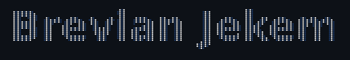

# My official name is Brevian Jekem

## About Me

developer | creator | founder

been coding since 2024, now building cool stuff

does : frontend (next.js or react), backend(node.js, python) , android development ( kotlin & flutter )

## Stack

Bellow are some of the tools I use for development.

## Projects

I am currently engaged in several exciting projects, each with its own unique focus and contribution to the digital landscape: Pleases check them [here](https://github.com/brave-0001/Brevian).

## Skills

- **Languages**: Proficient in Java, JavaScript, HTML, CSS, Php and their frameworks, enabling me to tackle a wide range of programming challenges and build diverse web applications.
- **Frameworks**: I have extensive experience with React and Laravel, among other frameworks, which allows me to develop robust, scalable, and efficient applications.
- **Tools**: My toolkit includes Git for version control, JetBrains for integrated development environments, and Copilot for AI-assisted coding, which collectively enhance my productivity and code quality.

Through these projects and skills, I aim to continue contributing to the tech community and making an impact through digital innovation. Whether it's connecting students to their dream internships, pioneering new digital solutions, or empowering freelancers to manage their workflows more effectively, my goal is to create technology that enriches lives and drives progress.
